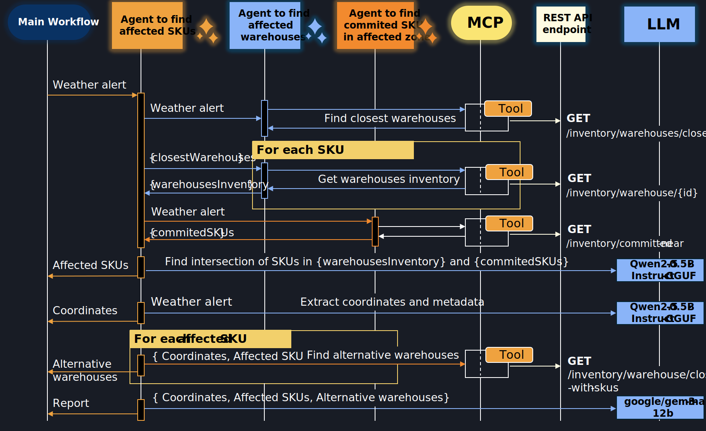

Source code for the blog entry: [https://samarkanov.info/blog/2025/jun/local-remote-llms-airflow-mlflow.html](https://samarkanov.info/blog/2026/apr/Automating-Logistic-Operations-with-GenAI-Agents-MCP.html)

Today, I am developing a multi-agent workflow for automating logistics operations and orchestrating them with Dify. I will be using a combination of Python scripts, REST API backend services, MCP tools, and local models to create a workflow that orchestrates all these components and is triggered every time a weather alert occurs near one of the warehouses I own. I'll be running my agents and workflow on a modest computer with no GPU, 32GB RAM, and 8 CPU cores.

